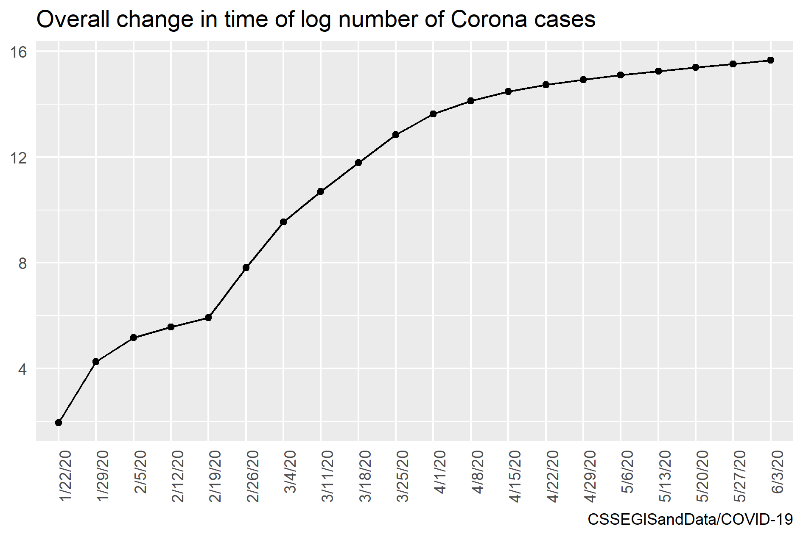

# **Modern Workflow in Data Science**

**Description of the project:** 

This repository will be used for the IPSDS course Modern Workflow in Data Science. 
In the project assignment 1 the infection rate worldwide will be examined with the help of 
corona data from https://github.com/CSSEGISandData/COVID-19/tree/master/csse_covid_19_data. 
Three different illustrations will be created and presented in the project: 

1. Overall change in time of log number of cases
2. Change in time of log number of cases by country 
3. Change in time by country of rate of infection per 100,000 cases

**Organization of the project:** 

The project (assignment 1) is divided into the three main folders input, output and scripts. 

- input: The input folder in the subfolder raw contains the stored raw data with current timestamp. 
These raw data do not have to be downloaded manually but are automatically stored there when using 
the scripts. The raw data (.csv) is not pushed by the gitignore file on the top level, 
but the different time stamps are kept locally and can be reconstructed. 
- scripts: The scripts folder contains the two R-files PREP.R and ANALYZE.R. 
´PREP.R downloads the current data from: https://github.com/CSSEGISandData/COVID-19/tree/master/csse_covid_19_data, 
merges datasets, cleans and harmonize, reshapes and saves it. ANALYZE.R uses the generated datasets from PREP.R 
and creates three graphics for the project report.
- output: The output folder contains the two subfolders data and png. The output/data directory contains the clean 
data at the time of running the data preparation script (PREP.R). The output/data is provided with a time stamp 
to document possible changes/updates and to retrieve old versions of the data but cannot be pushed to github because
.csv format is not allowed. The files without a timestamp is the current data and is then used in the ANALYZE.R script.

**Steps to start the project:**  

1. Create the folder environment explained in "Organization of the project" 
or clone the git repo using git with the command:
    - git clone https://github.com/StefZimm/Modern-Workflows.git
2. Go to "assignment_1/scripts subfolder".
3. Open the PREP.R file and set your paths:
    - rawdir <- "C:/clone/Modern Workflows/assignment_1/input/raw/"
    - outdir <- "C:/clone/Modern Workflows/assignment_1/output/data/"
4. Run the PREP.R file and you should get some local datasets in "assignment_1/output/data/"
5. Open the ANALYZE.R file and set your paths:
    - datadir <- "C:/clone/Modern Workflows/assignment_1/output/data/"
    - graphdir <- "C:/clone/Modern Workflows/assignment_1/output/png/"
6. Run the ANALYZE.R file and you should get three graphics in "assignment_1/output/png/"
7. Now you can write your report. 

**Main findings of the project:** 

The graph shows the log total number of corona cases worldwide. We see an increase in the number of cases over the time period until June. The increase in the log total number of corona cases is becoming progressively smaller and flattens out. 

In this graph we again see the log total number of corona cases by country. Certain countries are highlighted in colour. In Italy, for example, we see how much the numbers increased at the end of February, while South Africa and Russia increased much later. 

The last graph shows the rate of infection per 100,000 cases. Here we can see, for example, that South Africa has felt little impact of the corona crisis compared to the other countries. Germany seems to have coped well with the corona crisis compared to many other countries. The rate of infection per 100,000 cases is significantly lower than in the other countries highlighted. 

